# RescueMesh architecture

The living architecture of RescueMesh Phase 1: what runs where, how the pieces talk, what happens in
every scenario we must demonstrate, and how we measure it. It started as the Phase 1 architecture
document (27 Oct 2026) and is now kept in step with the code. Every diagram renders on GitHub
(Mermaid).

- **Why** each choice was made, and what we rejected: [design-log.md](design-log.md). Decision IDs
  (`D1`, `D26`, ...) in this file point there.
- **Exact messages, encodings and timers**: [protocol.md](protocol.md).
- **Who owns which file, and the working rules**: [AGENTS.md](../AGENTS.md).

**Keep it current.** A PR that changes a component, a message, a timer, a flow or a decision updates
the matching section and diagram here in the same PR, and adds or amends the design-log entry
(AGENTS.md, "Design decisions").

**Status labels.** Phase 1 is half built. Every component and flow below says how far it is:

| Label        | Meaning                                                                    |
|--------------|----------------------------------------------------------------------------|
| **built**    | Works on `main` and is covered by tests.                                   |
| **template** | Signatures and docs exist; the body is a placeholder (`TODO(<part>)`).     |
| **planned**  | Decided, but no code yet, or the code needs a contract change first.       |
| **open**     | Not decided; see the design-log entry for options and a recommendation.    |

---

## 1. Purpose and scope

RescueMesh coordinates emergency response on a campus. Clients report incidents; a cloud of three
equal nodes decides which responder goes to each incident, and every report gets exactly one
answer, even while a node is silent for up to 20 s.

**In scope for Phase 1 (due 4 Nov 2026, feature freeze 31 Oct):** the three-node cloud, the incident
processing and coordination service, a distributed election that assigns each request to a node,
injected failures of up to 20 s, rejoin with state recovery, and stress tests with measured results.

**Out of scope (Phase 2):** discovery service, peer-to-peer exchange, offline reconciliation. Section
13 lists the hooks we leave for them (D69).

## 2. Requirements and how the design meets them

| Requirement (project description)                         | Mechanism                                                               | Status   | Decisions |
|-----------------------------------------------------------|-------------------------------------------------------------------------|----------|-----------|
| Transparency: the client never knows which node works     | Client sends every request to all three nodes; any node may reply        | built | D6, D17, D53, D112 |
| An election picks the coordinator                          | Raft leader election (openraft)                                         | built    | D1, D14   |
| An election picks the node for each request, by load       | Per-request load bidding; leader dispatch as baseline                   | built | D2, D3, D45, D114 |
| A node may go silent up to 20 s; the others continue       | 2 of 3 is a Raft majority; takeover of in-flight requests               | built    | D12, D13, D41, D42, D110 |
| The revived node rebuilds state before it participates     | Raft log replay, then the `serving` gate                                 | built | D24, D46, D75 |
| One answer per report, even with retries and duplicates   | Unique request IDs, first commit wins, reply after commit               | built    | D8, D9, D27 |
| Measured, statistically meaningful results                | JSONL event logs on every process; experiments E1–E6, with a runner and analysis | built; **the lab runs are still to do** | D55, D56, D63, D130 |
| One server left still handles the clients                  | Degraded mode: labelled provisional answers, replayed through Raft on return | built | D120–D125 |
| A machine physically off comes back                        | Raft log and vote on disk, then the same catch-up as a silence           | built; **real power-off is untested** | D118 |
| Remote invocation through a ready-made RPC                 | tarpc on the peer port, typed methods                                    | built | D119 |
| Group communication                                        | `PeerSet::broadcast`, `MeshClient`, Raft for total order                 | built | D126 |
| Publish-subscribe                                          | Zone subscriptions in Phase 2; documented only                           | planned | D131 |

### System model

- **Nodes.** Three fixed cloud nodes with IDs 1, 2, 3 and addresses from one config file; three
  client machines running many simulated users each.
- **Network.** One campus LAN. Messages may be delayed, lost, duplicated or reordered, so every
  state-changing request carries a unique ID.
- **Failures.** Omission failures (a node stops sending and receiving), injected in the transport.
  At most one faulty cloud node at a time. No Byzantine behaviour. Process crashes are not a
  supported fault in Phase 1 (D24).
- **Timing.** No trusted bound on message delay. Safety never depends on timeouts; only liveness
  does.
- **Clocks.** Synchronised with NTP for log correlation only. No protocol decision reads the wall
  clock (D30, D56).

### What a correct run looks like

1. No accepted request is lost: each one gets a committed result, or the client gives up after its
   retries and logs it.
2. At most one result is committed per request ID, even if several nodes compute it.
3. While one node is silent, the other two keep serving.
4. A returning node does not bid, plan or reply until it has caught up.
5. All nodes that applied the same log prefix show the same state digest.

---

## 3. Deployment view

Six machines on one LAN. Every node runs the same `node` binary; every client machine runs
`loadgen`. Any machine can run `ctl`. All of them read the same config file (D59, D60).

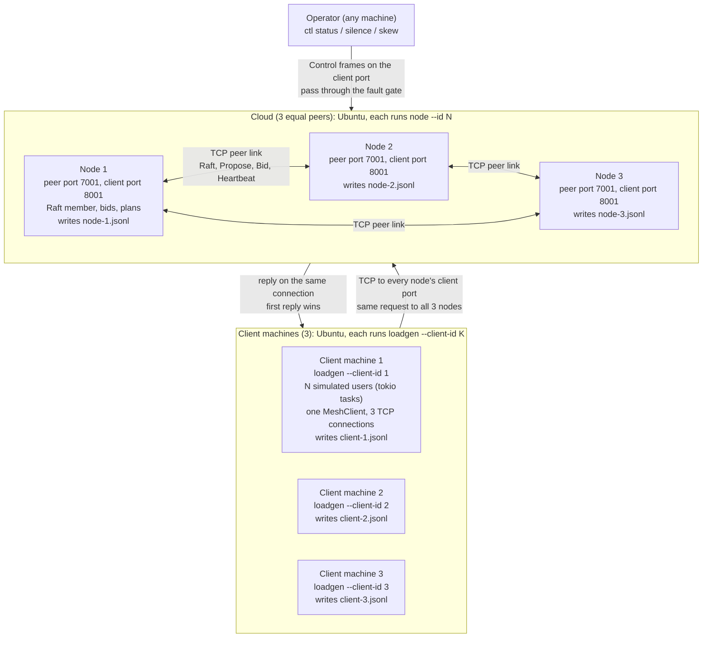
```mermaid
flowchart TB
    subgraph CM["Client machines (3): Ubuntu, each runs loadgen --client-id K"]
        direction LR
        K1["Client machine 1<br/>loadgen --client-id 1<br/>N simulated users (tokio tasks)<br/>one MeshClient, 3 TCP connections<br/>writes client-1.jsonl"]
        K2["Client machine 2<br/>loadgen --client-id 2<br/>writes client-2.jsonl"]
        K3["Client machine 3<br/>loadgen --client-id 3<br/>writes client-3.jsonl"]
    end
    subgraph CL["Cloud (3 equal peers): Ubuntu, each runs node --id N"]
        direction LR
        N1["Node 1<br/>peer port 7001, client port 8001<br/>Raft member, bids, plans<br/>writes node-1.jsonl"]
        N2["Node 2<br/>peer port 7001, client port 8001<br/>writes node-2.jsonl"]
        N3["Node 3<br/>peer port 7001, client port 8001<br/>writes node-3.jsonl"]
        N1 <-->|"TCP peer link<br/>Raft, Propose, Bid, Heartbeat"| N2
        N2 <-->|"TCP peer link"| N3
        N1 <-->|"TCP peer link"| N3
    end
    OP["Operator (any machine)<br/>ctl status / silence / skew"]
    CM -->|"TCP to every node's client port<br/>same request to all 3 nodes"| CL
    CL -->|"reply on the same connection<br/>first reply wins"| CM
    OP -->|"Control frames on the client port<br/>pass through the fault gate"| CL
```

| Machine        | Process                | Listens on                                   | Writes                    |
|----------------|------------------------|----------------------------------------------|---------------------------|
| Cloud 1–3      | `node --config lab.toml --id N` | `peer_addr` (TCP, default port 7001) and `client_addr` (TCP, default port 8001), from the config | `runs/<..>/node-N.jsonl`, stderr log |
| Client 1–3     | `loadgen --config lab.toml --client-id K --users U` | nothing (outgoing connections only) | `runs/<..>/client-K.jsonl` |
| Any            | `ctl --config lab.toml status` | nothing                               | stdout                    |

**Network requirements.** Peer ports must be reachable between the three node machines, client
ports from the client machines and the operator (`sudo ufw allow 7001/tcp`, `sudo ufw allow
8001/tcp`). NTP on all six machines. Same git commit and toolchain everywhere (D15).

**Changes from the Phase 1 document.** Clients use TCP instead of UDP (D17); two ports per node
instead of three, with `ctl` on the client port (D18); events are JSON Lines instead of CSV (D55).

---

## 4. Logical view: inside one node

The Phase 1 document numbered the node's components C1–C11 and the client's K1–K4. The numbering is
kept so the report can refer to it; the table maps each to its module, owner and status.

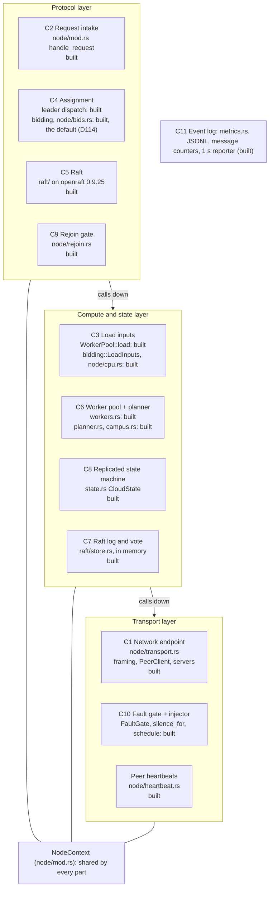
```mermaid
flowchart TB
    subgraph TR["Transport layer"]
        direction LR
        C1["C1 Network endpoint<br/>node/transport.rs<br/>framing, PeerClient, servers<br/>built"]
        C10["C10 Fault gate + injector<br/>FaultGate, silence_for, schedule: built"]
        HB["Peer heartbeats<br/>node/heartbeat.rs<br/>built"]
    end
    subgraph PR["Protocol layer"]
        direction LR
        C2["C2 Request intake<br/>node/mod.rs handle_request<br/>built"]
        C4["C4 Assignment<br/>leader dispatch: built<br/>bidding, node/bids.rs: built, the default (D114)"]
        C5["C5 Raft<br/>raft/ on openraft 0.9.25<br/>built"]
        C9["C9 Rejoin gate<br/>node/rejoin.rs<br/>built"]
    end
    subgraph CS["Compute and state layer"]
        direction LR
        C3["C3 Load inputs<br/>WorkerPool::load: built<br/>bidding::LoadInputs, node/cpu.rs: built"]
        C6["C6 Worker pool + planner<br/>workers.rs: built<br/>planner.rs, campus.rs: built"]
        C8["C8 Replicated state machine<br/>state.rs CloudState<br/>built"]
        C7["C7 Raft log and vote<br/>raft/store.rs, in memory<br/>built"]
    end
    C11["C11 Event log: metrics.rs, JSONL, message counters, 1 s reporter (built)"]
    CTX["NodeContext (node/mod.rs): shared by every part"]
    PR -->|calls down| CS
    CS -->|calls down| TR
    PR --- CTX
    CS --- CTX
    TR --- CTX
```

| #   | Component                 | Module(s)                                   | Owner | Status   | Responsibility |
|-----|---------------------------|---------------------------------------------|-------|----------|----------------|
| C1  | Network endpoint          | `node/transport.rs`                         | C     | built    | Length-delimited frames, one multiplexed connection per peer (D19) with a reconnect cooldown after a failed connect (D89–D92), peer and client servers, `TCP_NODELAY` (D20). |
| C2  | Request intake            | `node/mod.rs::handle_request`               | A     | built    | Logs the request, checks `serving`, answers a decided request from state (D37), asks assignment for a decision, runs the executor path. |
| C3  | Load inputs               | `workers.rs::PoolLoad`, `bidding.rs::LoadInputs`, `ServiceTime`, `node/cpu.rs` | E, B | built (D82, D86, D107) | Queue length, running jobs, recent service time, CPU, recent wins: the inputs to the bid. |
| C4  | Assignment                | `node/mod.rs::decide_executor`, `node/bids.rs`, `bidding.rs` | B    | built (leader dispatch, the default; bidding, set by config, D34, D103) | Chooses the executor: the leader (D3) or the lowest bidder (D2). |
| C5  | Raft                      | `raft/mod.rs`, `raft/network.rs`            | A     | built    | openraft behind `Consensus` (D14): election, replication, forwarding (D26), Raft events. |
| C6  | Worker pool and planner   | `node/workers.rs`, `planner.rs`, `campus.rs` | E    | built    | Plans off the async runtime with a bounded queue, refusing work when full (D48, D71, D72); deterministic planner: nearest free responder with the needed capability, +200 m for another zone, severe incidents fall back to any capability, CPU knob (D49, D93, D94, D96, D101); seeded campus (D97, D98). |
| C7  | Raft log and vote         | `raft/store.rs::LogStore`                   | A     | built    | In memory, never purged (D24). Phase 1 planned a disk log. |
| C8  | Replicated state machine  | `state.rs::CloudState`, `raft/store.rs::StateMachineStore` | A | built | Responders, results, counters, digest (D27–D31). |
| C9  | Rejoin gate               | `node/rejoin.rs`, `NodeContext::serving`    | D     | built    | Not serving and no elections from silence start until the applied index reaches the target commit learned after the silence (D46, D75, D5). |
| C10 | Fault gate and injector   | `transport.rs::FaultGate`, `node/faults.rs` | C     | built    | Drops all traffic but control (D13, D22, D23); manual faults, one at a time, 1 ms to 20 s (D74); scheduled faults from the leader, never overlapping (D12, D78); all of it switchable off with `faults.enabled` / `--faults off` (D77). |
| C11 | Event log                 | `metrics.rs`                                | all   | built    | JSONL events, message counters, per-second reports (D55). |
| —   | Peer heartbeats           | `node/heartbeat.rs`                         | C     | built    | Failure detector for takeover: suspect a peer after 3 missed 50 ms heartbeats, logged for E3 (D41, D79). New since Phase 1. |
| —   | Takeover                  | `node/takeover.rs`                          | C     | built    | A node that lost a round plans the request if the winner is suspected, or nothing commits within max(200 ms, 3 × the winner's bid) (D42, D110). |
| K1  | Client middleware         | `client.rs::MeshClient`                     | F     | built    | Send to all nodes, retry with the same ID, first reply wins (D53, D112). |
| K2  | Simulated user            | `bin/loadgen.rs`, `campus::random_incident` | F, E  | built | Uniform random incidents, seeded or from OS randomness (D99, D102). |
| K3  | Workload controller       | `bin/loadgen.rs` arguments                  | F     | built    | Users, duration, think time, seed, open-loop rate, warm-up (D54). |
| K4  | Client metrics            | `metrics.rs` client events                  | F     | built    | `client_sent`, `client_done`, `client_gave_up`, `client_link_up`, `client_link_down`. |
| —   | Operator tool             | `bin/ctl.rs`, `client::control`             | C     | built    | Status, silence, skew (D62). |
| —   | Degraded mode             | `node/degraded.rs`                          | C     | built    | The last node left answers provisionally and replays on return (D120–D124). |
| —   | Experiment runner         | `scripts/run-experiments.sh`, `experiments/` | all  | built    | Bash over SSH from a hosts file (D62, D130). Untested over SSH. |
| —   | Analysis                  | `analysis/analyze.py`                       | all   | built    | Python: every metric the spec lists, with 95% intervals (D64). |

### 4.1 Module dependencies

An arrow from X to Y means "X uses Y". The deterministic core (`state`, `bidding`, `planner`) uses
only `proto`, which is what keeps it free of network, clock and randomness (D30). Only `node/` and
`raft/network.rs` open sockets.

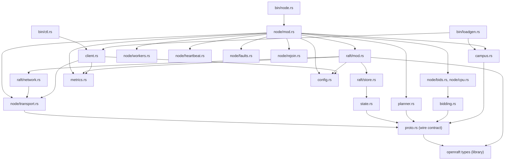
```mermaid
flowchart TD
    BNODE["bin/node.rs"] --> NODE["node/mod.rs"]
    BCTL["bin/ctl.rs"] --> CLIENT["client.rs"]
    BLOAD["bin/loadgen.rs"] --> CLIENT
    BLOAD --> CAMPUS["campus.rs"]
    NODE --> RAFT["raft/mod.rs"]
    NODE --> TRANSPORT["node/transport.rs"]
    NODE --> WORKERS["node/workers.rs"]
    NODE --> HEART["node/heartbeat.rs"]
    NODE --> FAULTS["node/faults.rs"]
    NODE --> REJOIN["node/rejoin.rs"]
    NODE --> PLANNER["planner.rs"]
    NODE --> CAMPUS
    NODE --> BIDS["node/bids.rs, node/cpu.rs"]
    BIDS --> BIDDING["bidding.rs"]
    RAFT --> NETWORK["raft/network.rs"]
    RAFT --> STORE["raft/store.rs"]
    NETWORK --> TRANSPORT
    STORE --> STATE["state.rs"]
    CLIENT --> TRANSPORT
    TRANSPORT --> PROTO["proto.rs (wire contract)"]
    STATE --> PROTO
    PLANNER --> PROTO
    BIDDING --> PROTO
    CAMPUS --> PROTO
    NODE --> METRICS["metrics.rs"]
    RAFT --> METRICS
    CLIENT --> METRICS
    NODE --> CONFIG["config.rs"]
    RAFT --> CONFIG
    CLIENT --> CONFIG
    PROTO --> OR["openraft types (library)"]
    RAFT --> OR
```

### 4.2 Ownership map

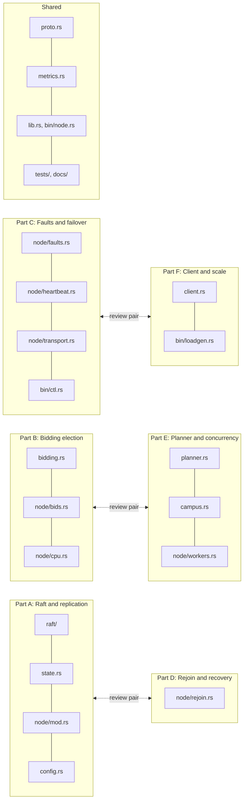
```mermaid
flowchart LR
    subgraph A["Part A: Raft and replication"]
        A1["raft/"] --- A2["state.rs"] --- A3["node/mod.rs"] --- A4["config.rs"]
    end
    subgraph B["Part B: Bidding election"]
        B1["bidding.rs"] --- B2["node/bids.rs"] --- B3["node/cpu.rs"]
    end
    subgraph C["Part C: Faults and failover"]
        C1["node/faults.rs"] --- C2["node/heartbeat.rs"] --- C3["node/transport.rs"] --- C4["bin/ctl.rs"]
    end
    subgraph D["Part D: Rejoin and recovery"]
        D1["node/rejoin.rs"]
    end
    subgraph E["Part E: Planner and concurrency"]
        E1["planner.rs"] --- E2["campus.rs"] --- E3["node/workers.rs"]
    end
    subgraph F["Part F: Client and scale"]
        F1["client.rs"] --- F2["bin/loadgen.rs"]
    end
    subgraph S["Shared"]
        S1["proto.rs"] --- S2["metrics.rs"] --- S3["lib.rs, bin/node.rs"] --- S4["tests/, docs/"]
    end
    A <-.->|review pair| D
    B <-.->|review pair| E
    C <-.->|review pair| F
```

---

## 5. Communication

### 5.1 Channels

| Channel                   | Transport                                   | Pattern                                           | Status | Decisions |
|---------------------------|---------------------------------------------|---------------------------------------------------|--------|-----------|
| Client → every node       | TCP to `client_addr`                        | `ClientFrame::Request`, the same frame to all three | built | D6, D17, D112 |
| Node → client             | same connection                             | `ServerFrame::Reply`, matched by request ID       | built  | D8, D37 |
| `ctl` → one node          | TCP to `client_addr`                        | `ClientFrame::Control` / `ServerFrame::Control`, bypasses the fault gate | built | D18, D23 |
| Node ↔ node               | one TCP connection per peer pair direction, multiplexed | tarpc calls to `proto::PeerRpc` | built | D7, D119 |

Every frame: a 4-byte big-endian length, then a bincode body (varint integers, at most 16 MiB,
no trailing bytes). A malformed frame closes the connection (D16).

### 5.1a Group communication (built, D126)

The application sends once and the middleware makes the copies, so the layers stay distinct.

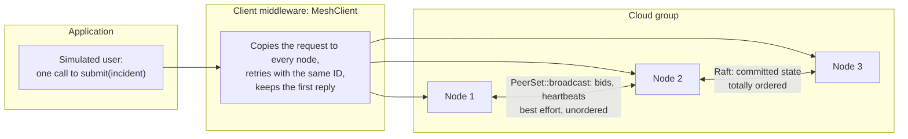
```mermaid
flowchart LR
    subgraph APP["Application"]
        USER["Simulated user:<br/>one call to submit(incident)"]
    end
    subgraph MW["Client middleware: MeshClient"]
        COPY["Copies the request to every node,<br/>retries with the same ID,<br/>keeps the first reply"]
    end
    subgraph CLOUD["Cloud group"]
        N1["Node 1"]
        N2["Node 2"]
        N3["Node 3"]
    end
    USER --> COPY
    COPY --> N1
    COPY --> N2
    COPY --> N3
    N1 <-->|"PeerSet::broadcast: bids, heartbeats<br/>best effort, unordered"| N2
    N2 <-->|"Raft: committed state<br/>totally ordered"| N3
```

| Group send | Guarantee | What covers a lost copy |
|------------|-----------|-------------------------|
| `MeshClient::submit` to all nodes | best effort, unordered | the client's retry with the same ID (D52) |
| Bids, `PeerSet::broadcast` | best effort, unordered | a split decision, settled by first commit (D27) |
| Heartbeats, `PeerSet::broadcast` | best effort, unordered | the next heartbeat; a real loss becomes a suspicion (D79) |
| Committed state, Raft | totally ordered, agreed by a majority | openraft's log replication |

### 5.2 Message catalogue

| Message                         | From → to              | Purpose                                              | Status   | Phase 1 name |
|---------------------------------|------------------------|------------------------------------------------------|----------|--------------|
| `ClientFrame::Request(ClientRequest { id, attempt, incident })` | client → all nodes | ask for a plan | built | `IncidentRequest` |
| `ServerFrame::Reply(ClientReply { id, from, body: Done(result) })` | node → client | the committed result | built | `ResponsePlan` |
| `ReplyBody::Rejected(reason)`   | node → client          | defined, never sent (D36)                            | unused   | — |
| `ClientFrame::Control(Status / Silence / SkewLoad)` | ctl → node | inspect and inject faults            | built (`Silence` rejects overlaps and durations outside 1 ms to 20 s, D74) | experiment runner port |
| `PeerBody::Raft(AppendEntries)` | leader → follower      | replicate; empty = Raft heartbeat                    | built    | `AppendEntries` |
| `PeerBody::Raft(Vote)`          | candidate → peers      | election                                             | built    | `RequestVote` |
| `PeerBody::Raft(InstallSnapshot)` | leader → lagging node | never used: snapshots are off (D24)                 | built, unused | `InstallSnapshot` |
| `PeerBody::Propose(Command)`    | follower → leader      | commit on the follower's behalf (D26)                | built    | `ProposePlan` |
| `PeerBody::Bid(Bid { request, attempt, score })` | serving node → peers | per-request, per-attempt bid (D2, D84); not waited for (D104) | built | `Bid` |
| `PeerBody::Heartbeat`           | every node → every peer | failure detector for takeover; any answer counts as alive (D41, D79) | built | — (new) |
| `PeerBody::ReadIndex` / `PeerReply::ReadIndex` | returning node → leader | commit index confirmed by a majority, the rejoin target (D76) | built | — (new) |
| `PeerReply::StaleTerm { current }` | receiver → sender   | non-Raft message from an older term (D21)            | built    | — |
| `PeerBody::FaultOrder { ms }` / `PeerReply::FaultOrder` | leader → victim | scheduled fault; the reply says obeyed or why not (D12, D78) | built | `FaultOrder` |
| Claim                           | winner → peers         | not planned; replaced by local `just_won` (D44)      | —        | `Claim` |
| PreVote                         | —                      | not available in openraft 0.9.25 (D5)                | open     | `PreVote` |

### 5.3 Multiplexed peer calls

One connection per peer carries many tarpc calls at once. Replies may come back in any order, and
tarpc matches them to calls. A slow forwarded proposal never delays a heartbeat (D119).

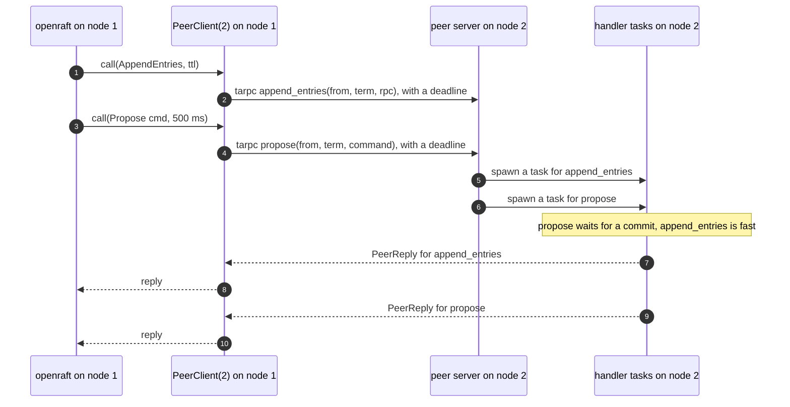
```mermaid
sequenceDiagram
    autonumber
    participant R as openraft on node 1
    participant PC as PeerClient(2) on node 1
    participant S as peer server on node 2
    participant H as handler tasks on node 2
    R->>PC: call(AppendEntries, ttl)
    PC->>S: tarpc append_entries(from, term, rpc), with a deadline
    R->>PC: call(Propose cmd, 500 ms)
    PC->>S: tarpc propose(from, term, command), with a deadline
    S->>H: spawn a task for append_entries
    S->>H: spawn a task for propose
    Note over H: propose waits for a commit, append_entries is fast
    H-->>PC: PeerReply for append_entries
    PC-->>R: reply
    H-->>PC: PeerReply for propose
    PC-->>R: reply
```

### 5.4 How a node handles an incoming peer message

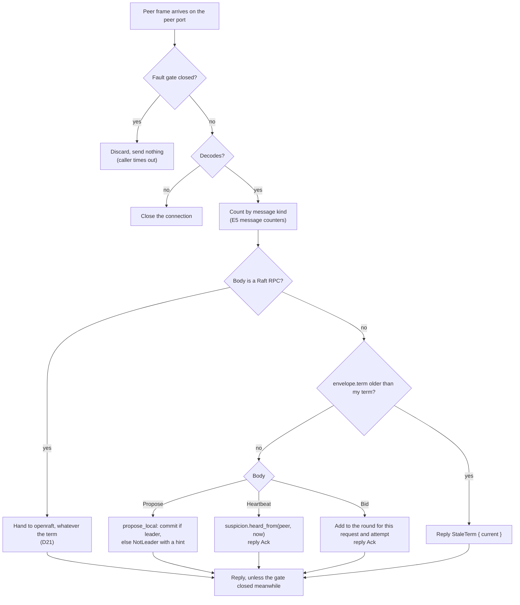
```mermaid
flowchart TD
    IN["Peer frame arrives on the peer port"] --> G{"Fault gate closed?"}
    G -->|yes| DROP["Discard, send nothing<br/>(caller times out)"]
    G -->|no| DEC{"Decodes?"}
    DEC -->|no| CLOSE["Close the connection"]
    DEC -->|yes| COUNT["Count by message kind<br/>(E5 message counters)"]
    COUNT --> RAFTQ{"Body is a Raft RPC?"}
    RAFTQ -->|yes| OR["Hand to openraft, whatever the term<br/>(D21)"]
    RAFTQ -->|no| TERM{"envelope.term older than my term?"}
    TERM -->|yes| STALE["Reply StaleTerm { current }"]
    TERM -->|no| KIND{"Body"}
    KIND -->|Propose| PL["propose_local: commit if leader,<br/>else NotLeader with a hint"]
    KIND -->|Heartbeat| HB["suspicion.heard_from(peer, now)<br/>reply Ack"]
    KIND -->|Bid| BID["Add to the round for this request and attempt<br/>reply Ack"]
    OR --> REPLY["Reply, unless the gate closed meanwhile"]
    PL --> REPLY
    HB --> REPLY
    BID --> REPLY
    STALE --> REPLY
```

### 5.5 Reconnecting to a peer that is down (built, D89–D92)

If a connect to a peer fails (refused, or still pending when the call's deadline passes), calls to
that peer fail at once with `TransportError::Backoff` for `2 × raft_heartbeat_ms` (100 ms). The
first call after the window tries again. openraft maps `Backoff` to `Unreachable` and backs off by
the same amount (D32), so all traffic to a downed peer behaves alike. A *silenced* peer never
enters this state: its listener stays up and connects succeed (D22).

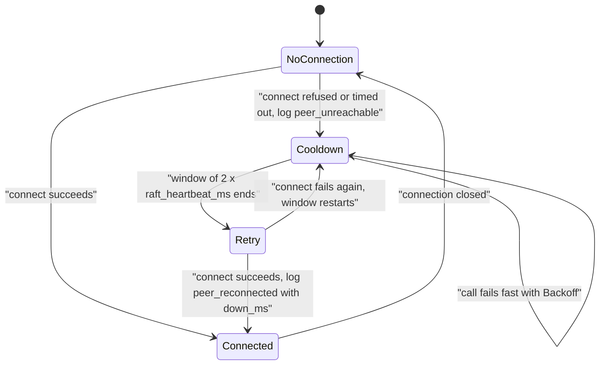
```mermaid
stateDiagram-v2
    [*] --> NoConnection
    NoConnection --> Connected: "connect succeeds"
    Connected --> NoConnection: "connection closed"
    NoConnection --> Cooldown: "connect refused or timed out, log peer_unreachable"
    Cooldown --> Cooldown: "call fails fast with Backoff"
    Cooldown --> Retry: "window of 2 x raft_heartbeat_ms ends"
    Retry --> Cooldown: "connect fails again, window restarts"
    Retry --> Connected: "connect succeeds, log peer_reconnected with down_ms"
```

---

## 6. Key flows

Every flow below names its status. Node IDs are examples; the leader moves after faults.

### 6.1 Cluster start, formation and campus seeding (built)

Every node initializes Raft with the full membership (D25); the peer port is serving before Raft
starts (D61); the first leader registers the campus responders through the log (D38).

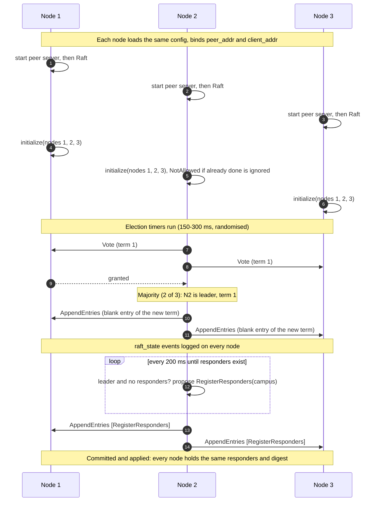
```mermaid
sequenceDiagram
    autonumber
    participant N1 as Node 1
    participant N2 as Node 2
    participant N3 as Node 3
    Note over N1,N3: Each node loads the same config, binds peer_addr and client_addr
    N1->>N1: start peer server, then Raft
    N2->>N2: start peer server, then Raft
    N3->>N3: start peer server, then Raft
    N1->>N1: initialize(nodes 1, 2, 3)
    N2->>N2: initialize(nodes 1, 2, 3), NotAllowed if already done is ignored
    N3->>N3: initialize(nodes 1, 2, 3)
    Note over N1,N3: Election timers run (150-300 ms, randomised)
    N2->>N1: Vote (term 1)
    N2->>N3: Vote (term 1)
    N1-->>N2: granted
    Note over N2: Majority (2 of 3): N2 is leader, term 1
    N2->>N1: AppendEntries (blank entry of the new term)
    N2->>N3: AppendEntries (blank entry of the new term)
    Note over N1,N3: raft_state events logged on every node
    loop every 200 ms until responders exist
        N2->>N2: leader and no responders? propose RegisterResponders(campus)
    end
    N2->>N1: AppendEntries [RegisterResponders]
    N2->>N3: AppendEntries [RegisterResponders]
    Note over N1,N3: Committed and applied: every node holds the same responders and digest
```

### 6.2 Normal request under leader dispatch (built)

The default policy today (D34). The leader is the only executor; followers stay quiet (D33).

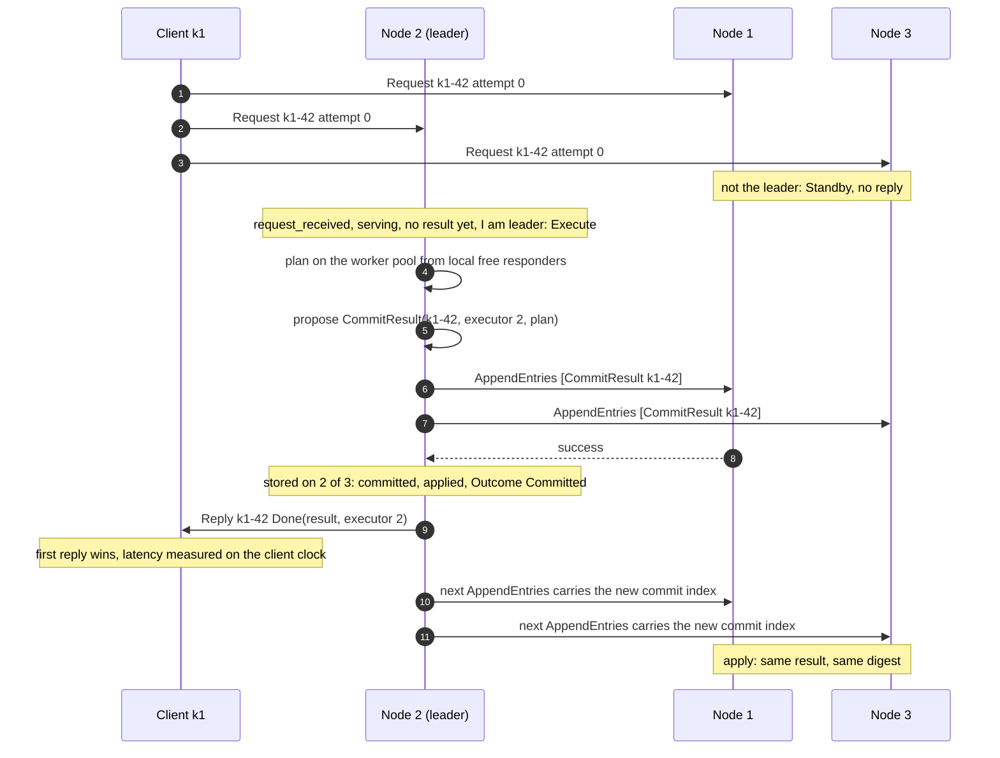
```mermaid
sequenceDiagram
    autonumber
    participant K as Client k1
    participant L as Node 2 (leader)
    participant F1 as Node 1
    participant F3 as Node 3
    K->>F1: Request k1-42 attempt 0
    K->>L: Request k1-42 attempt 0
    K->>F3: Request k1-42 attempt 0
    Note over F1,F3: not the leader: Standby, no reply
    Note over L: request_received, serving, no result yet, I am leader: Execute
    L->>L: plan on the worker pool from local free responders
    L->>L: propose CommitResult(k1-42, executor 2, plan)
    L->>F1: AppendEntries [CommitResult k1-42]
    L->>F3: AppendEntries [CommitResult k1-42]
    F1-->>L: success
    Note over L: stored on 2 of 3: committed, applied, Outcome Committed
    L->>K: Reply k1-42 Done(result, executor 2)
    Note over K: first reply wins, latency measured on the client clock
    L->>F1: next AppendEntries carries the new commit index
    L->>F3: next AppendEntries carries the new commit index
    Note over F1,F3: apply: same result, same digest
```

### 6.3 A follower commits through the leader (built)

Any node can propose (D26). This is the path every bidding winner that is not the leader takes.

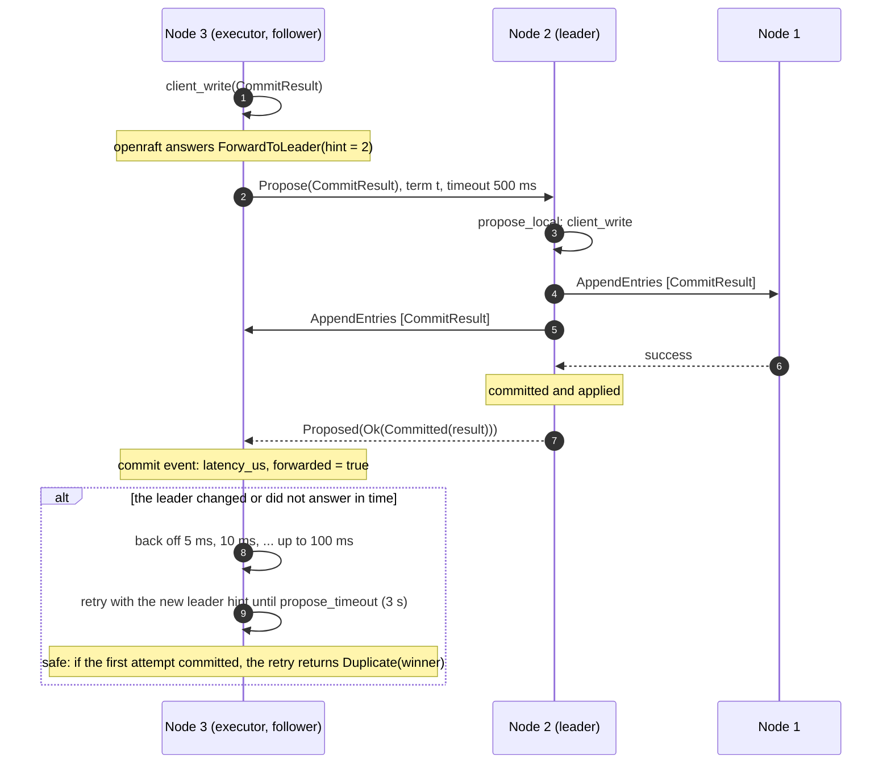
```mermaid
sequenceDiagram
    autonumber
    participant X as Node 3 (executor, follower)
    participant L as Node 2 (leader)
    participant F as Node 1
    X->>X: client_write(CommitResult)
    Note over X: openraft answers ForwardToLeader(hint = 2)
    X->>L: Propose(CommitResult), term t, timeout 500 ms
    L->>L: propose_local: client_write
    L->>F: AppendEntries [CommitResult]
    L->>X: AppendEntries [CommitResult]
    F-->>L: success
    Note over L: committed and applied
    L-->>X: Proposed(Ok(Committed(result)))
    Note over X: commit event: latency_us, forwarded = true
    alt the leader changed or did not answer in time
        X->>X: back off 5 ms, 10 ms, ... up to 100 ms
        X->>X: retry with the new leader hint until propose_timeout (3 s)
        Note over X: safe: if the first attempt committed, the retry returns Duplicate(winner)
    end
```

### 6.4 Client retry after the result is committed (built)

Any serving node that has the result answers at once (D37), so a retry never plans again.

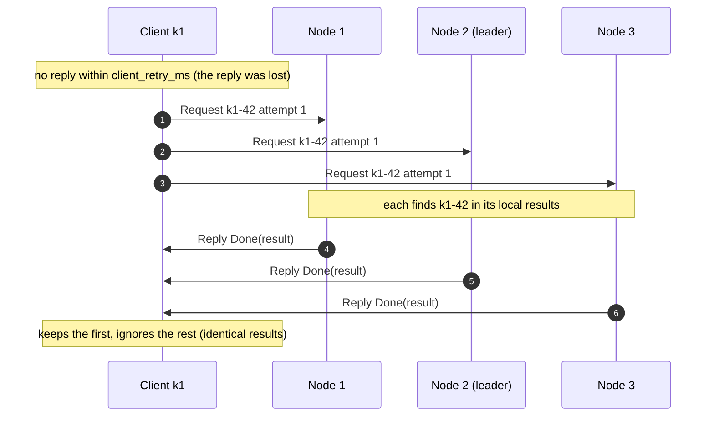
```mermaid
sequenceDiagram
    autonumber
    participant K as Client k1
    participant N1 as Node 1
    participant N2 as Node 2 (leader)
    participant N3 as Node 3
    Note over K: no reply within client_retry_ms (the reply was lost)
    K->>N1: Request k1-42 attempt 1
    K->>N2: Request k1-42 attempt 1
    K->>N3: Request k1-42 attempt 1
    Note over N1,N3: each finds k1-42 in its local results
    N1->>K: Reply Done(result)
    N2->>K: Reply Done(result)
    N3->>K: Reply Done(result)
    Note over K: keeps the first, ignores the rest (identical results)
```

### 6.5 Stale plan and re-plan (built)

Two executors picked the same free responder from their local copies. The log decides (D28); the
loser plans again, at most three times (D35).

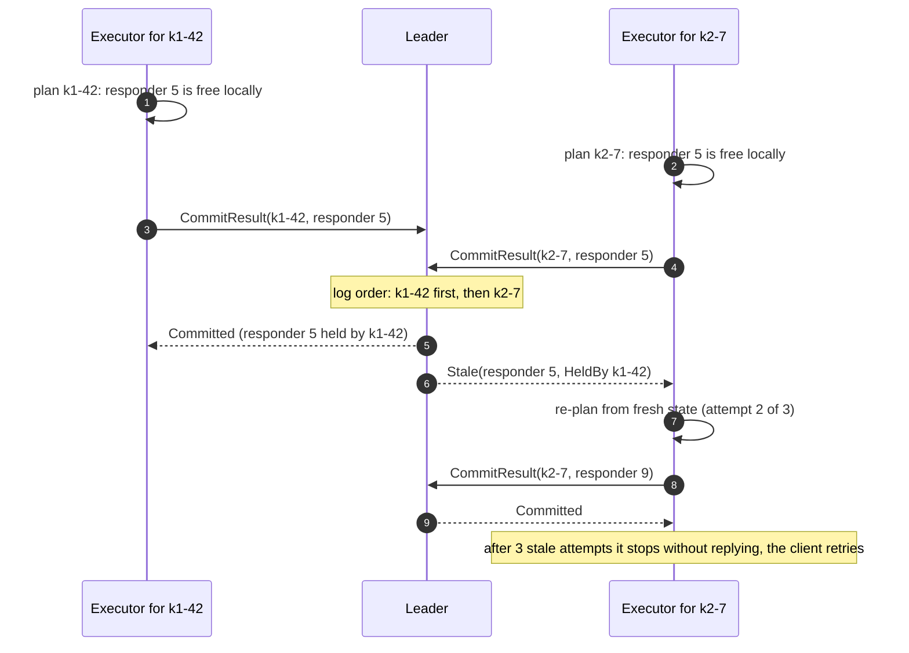
```mermaid
sequenceDiagram
    autonumber
    participant X1 as Executor for k1-42
    participant L as Leader
    participant X2 as Executor for k2-7
    X1->>X1: plan k1-42: responder 5 is free locally
    X2->>X2: plan k2-7: responder 5 is free locally
    X1->>L: CommitResult(k1-42, responder 5)
    X2->>L: CommitResult(k2-7, responder 5)
    Note over L: log order: k1-42 first, then k2-7
    L-->>X1: Committed (responder 5 held by k1-42)
    L-->>X2: Stale(responder 5, HeldBy k1-42)
    X2->>X2: re-plan from fresh state (attempt 2 of 3)
    X2->>L: CommitResult(k2-7, responder 9)
    L-->>X2: Committed
    Note over X2: after 3 stale attempts it stops without replying, the client retries
```

### 6.6 Normal request under bidding (built, the default, D2, D43–D45, D103, D114)

The bidding path, used when `policy.assignment = "bidding"`. Every serving node computes the same
winner from the same bids; there is no separate "you won" message. Each node times the window from
when the request reaches it (D43), so windows are slightly offset; two nodes that saw different
bids can both plan, and the first commit wins (D27). The score starts as expected wait with no CPU
part (D45). Rounds are per request and attempt, so a retry bids afresh (D84).

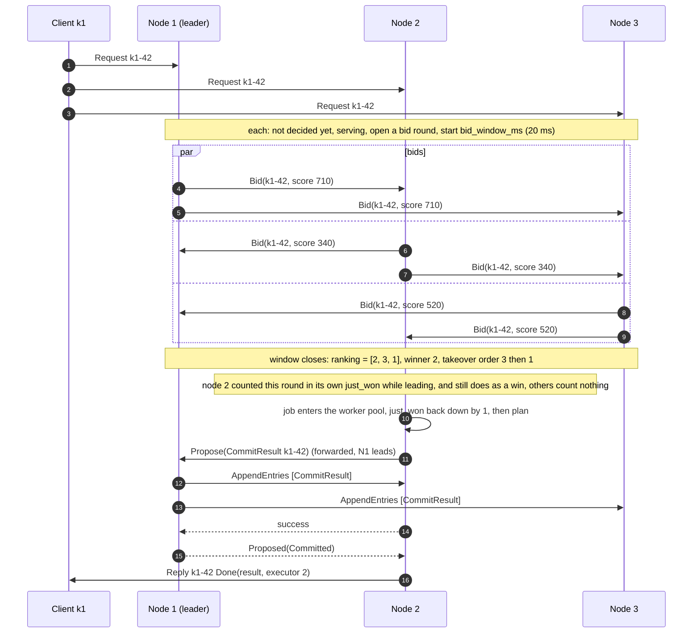
```mermaid
sequenceDiagram
    autonumber
    participant K as Client k1
    participant N1 as Node 1 (leader)
    participant N2 as Node 2
    participant N3 as Node 3
    K->>N1: Request k1-42
    K->>N2: Request k1-42
    K->>N3: Request k1-42
    Note over N1,N3: each: not decided yet, serving, open a bid round, start bid_window_ms (20 ms)
    par bids
        N1->>N2: Bid(k1-42, score 710)
        N1->>N3: Bid(k1-42, score 710)
    and
        N2->>N1: Bid(k1-42, score 340)
        N2->>N3: Bid(k1-42, score 340)
    and
        N3->>N1: Bid(k1-42, score 520)
        N3->>N2: Bid(k1-42, score 520)
    end
    Note over N1,N3: window closes: ranking = [2, 3, 1], winner 2, takeover order 3 then 1
    Note over N2: node 2 counted this round in its own just_won while leading, and still does as a win, others count nothing
    N2->>N2: job enters the worker pool, just_won back down by 1, then plan
    N2->>N1: Propose(CommitResult k1-42) (forwarded, N1 leads)
    N1->>N2: AppendEntries [CommitResult]
    N1->>N3: AppendEntries [CommitResult]
    N2-->>N1: success
    N1-->>N2: Proposed(Committed)
    N2->>K: Reply k1-42 Done(result, executor 2)
```

### 6.7 The winner goes silent mid-request (template, D41, D42)

The next bidder in the ranking takes over. If the old winner later proposes too, first commit wins
and its result is discarded (D27).

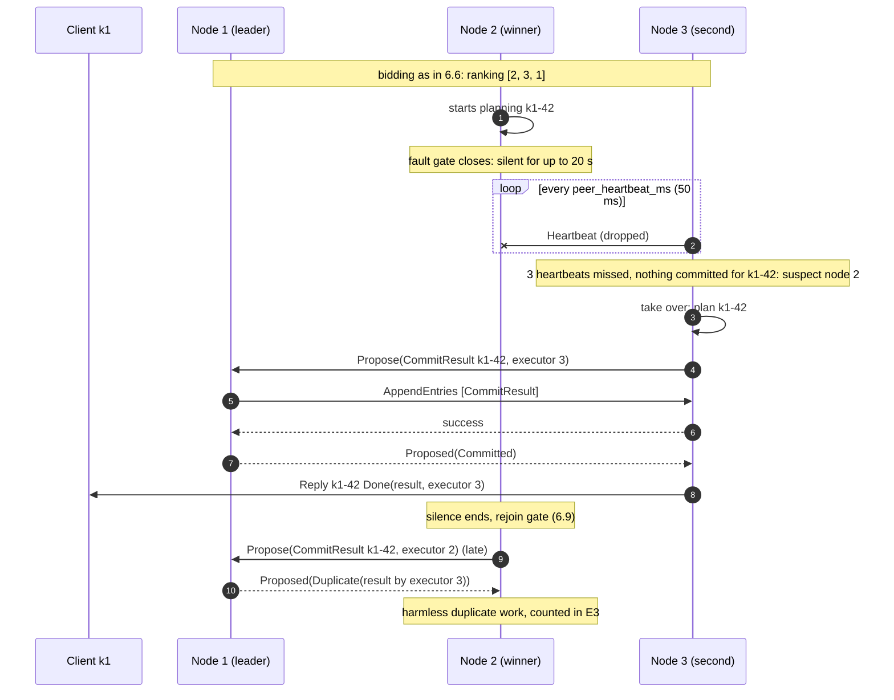
```mermaid
sequenceDiagram
    autonumber
    participant K as Client k1
    participant N1 as Node 1 (leader)
    participant N2 as Node 2 (winner)
    participant N3 as Node 3 (second)
    Note over N1,N3: bidding as in 6.6: ranking [2, 3, 1]
    N2->>N2: starts planning k1-42
    Note over N2: fault gate closes: silent for up to 20 s
    loop every peer_heartbeat_ms (50 ms)
        N3-xN2: Heartbeat (dropped)
    end
    Note over N3: 3 heartbeats missed, nothing committed for k1-42: suspect node 2
    N3->>N3: take over: plan k1-42
    N3->>N1: Propose(CommitResult k1-42, executor 3)
    N1->>N3: AppendEntries [CommitResult]
    N3-->>N1: success
    N1-->>N3: Proposed(Committed)
    N3->>K: Reply k1-42 Done(result, executor 3)
    Note over N2: silence ends, rejoin gate (6.9)
    N2->>N1: Propose(CommitResult k1-42, executor 2) (late)
    N1-->>N2: Proposed(Duplicate(result by executor 3))
    Note over N2: harmless duplicate work, counted in E3
```

### 6.8 The leader goes silent (built)

Tested end to end in `tests/replication.rs::cluster_keeps_committing_when_the_leader_goes_silent_and_it_catches_up_after`.

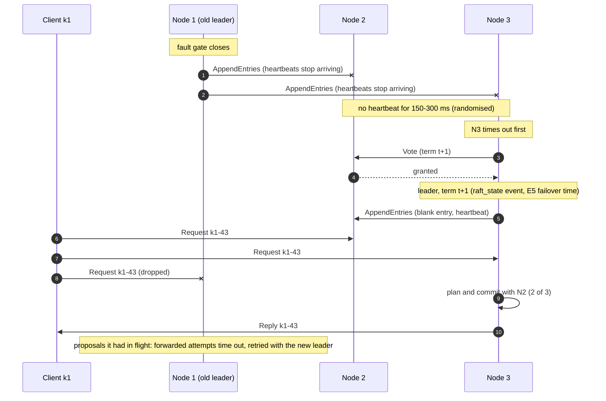
```mermaid
sequenceDiagram
    autonumber
    participant K as Client k1
    participant N1 as Node 1 (old leader)
    participant N2 as Node 2
    participant N3 as Node 3
    Note over N1: fault gate closes
    N1-xN2: AppendEntries (heartbeats stop arriving)
    N1-xN3: AppendEntries (heartbeats stop arriving)
    Note over N2,N3: no heartbeat for 150-300 ms (randomised)
    Note over N3: N3 times out first
    N3->>N2: Vote (term t+1)
    N2-->>N3: granted
    Note over N3: leader, term t+1 (raft_state event, E5 failover time)
    N3->>N2: AppendEntries (blank entry, heartbeat)
    K->>N2: Request k1-43
    K->>N3: Request k1-43
    K-xN1: Request k1-43 (dropped)
    N3->>N3: plan and commit with N2 (2 of 3)
    N3->>K: Reply k1-43
    Note over N1: proposals it had in flight: forwarded attempts time out, retried with the new leader
```

### 6.9 A node rejoins and catches up (built, D46, D75)

The returning node copies only what it missed by log replay (D24, D32), then the rejoin gate lets
it serve again (D46).

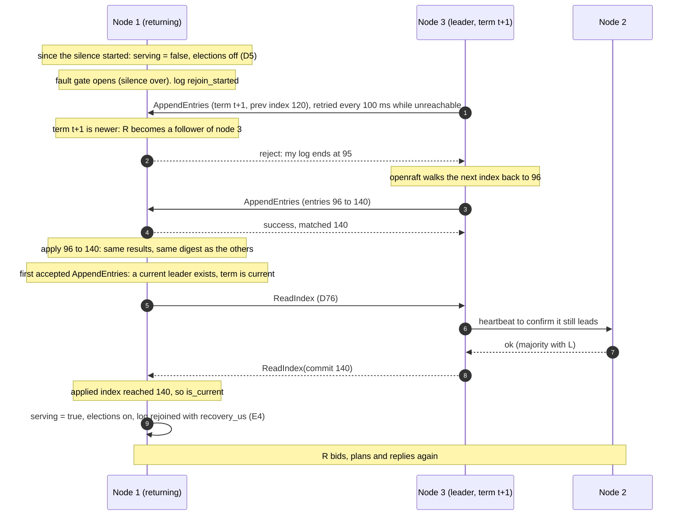
```mermaid
sequenceDiagram
    autonumber
    participant R as Node 1 (returning)
    participant L as Node 3 (leader, term t+1)
    participant N2 as Node 2
    Note over R: since the silence started: serving = false, elections off (D5)
    Note over R: fault gate opens (silence over). log rejoin_started
    L->>R: AppendEntries (term t+1, prev index 120), retried every 100 ms while unreachable
    Note over R: term t+1 is newer: R becomes a follower of node 3
    R-->>L: reject: my log ends at 95
    Note over L: openraft walks the next index back to 96
    L->>R: AppendEntries (entries 96 to 140)
    R-->>L: success, matched 140
    Note over R: apply 96 to 140: same results, same digest as the others
    Note over R: first accepted AppendEntries: a current leader exists, term is current
    R->>L: ReadIndex (D76)
    L->>N2: heartbeat to confirm it still leads
    N2-->>L: ok (majority with L)
    L-->>R: ReadIndex(commit 140)
    Note over R: applied index reached 140, so is_current
    R->>R: serving = true, elections on, log rejoined with recovery_us (E4)
    Note over R,N2: R bids, plans and replies again
```

If the returning node is still the leader (a silence shorter than an election timeout), no other
leader sends it AppendEntries. It then asks itself: openraft's `get_read_log_id` succeeds only
once a majority confirms it still leads; a stale leader's check fails and it waits for the new
leader's AppendEntries instead (D75, D76). A node that hears from no current leader stays
not serving and warns every 5 s.

### 6.10 Manual fault through `ctl` (built, D74)

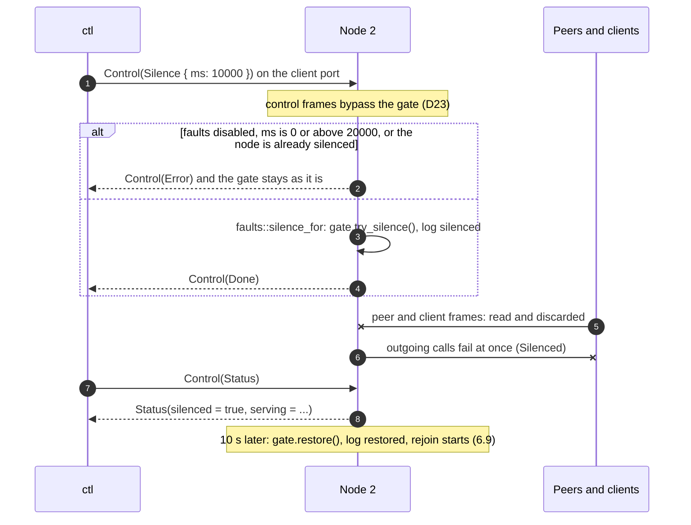
```mermaid
sequenceDiagram
    autonumber
    participant OP as ctl
    participant N as Node 2
    participant P as Peers and clients
    OP->>N: Control(Silence { ms: 10000 }) on the client port
    Note over N: control frames bypass the gate (D23)
    alt faults disabled, ms is 0 or above 20000, or the node is already silenced
        N-->>OP: Control(Error) and the gate stays as it is
    else
        N->>N: faults::silence_for: gate.try_silence(), log silenced
        N-->>OP: Control(Done)
    end
    P-xN: peer and client frames: read and discarded
    N-xP: outgoing calls fail at once (Silenced)
    OP->>N: Control(Status)
    N-->>OP: Status(silenced = true, serving = ...)
    Note over N: 10 s later: gate.restore(), log restored, rejoin starts (6.9)
```

### 6.11 Scheduled fault injection (built, D12, D78)

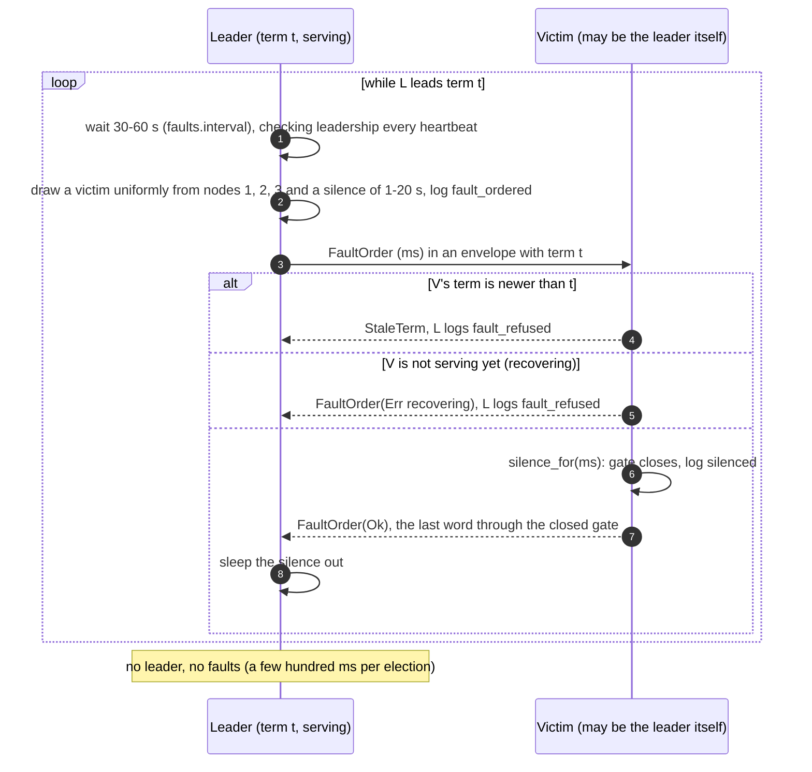
```mermaid
sequenceDiagram
    autonumber
    participant L as Leader (term t, serving)
    participant V as Victim (may be the leader itself)
    loop while L leads term t
        L->>L: wait 30-60 s (faults.interval), checking leadership every heartbeat
        L->>L: draw a victim uniformly from nodes 1, 2, 3 and a silence of 1-20 s, log fault_ordered
        L->>V: FaultOrder (ms) in an envelope with term t
        alt V's term is newer than t
            V-->>L: StaleTerm, L logs fault_refused
        else V is not serving yet (recovering)
            V-->>L: FaultOrder(Err recovering), L logs fault_refused
        else
            V->>V: silence_for(ms): gate closes, log silenced
            V-->>L: FaultOrder(Ok), the last word through the closed gate
            L->>L: sleep the silence out
        end
    end
    Note over L: no leader, no faults (a few hundred ms per election)
```

A leader that silences itself cannot tell its successor. The successor starts its own wait when
it takes over, and validation requires `interval_min_ms >= silence_max_ms`, so its first order
comes after the old silence has ended (D78). The RNG is seeded per term from `faults.seed`, so a
run can be repeated.

### 6.12 What a node does with a client request (built)

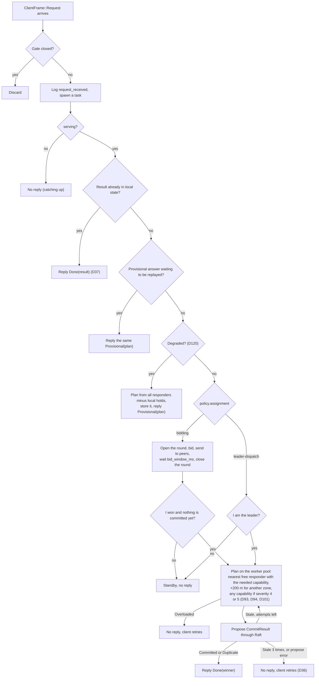
```mermaid
flowchart TD
    REQ["ClientFrame::Request arrives"] --> GATE{"Gate closed?"}
    GATE -->|yes| DROP["Discard"]
    GATE -->|no| LOG["Log request_received, spawn a task"]
    LOG --> SERV{"serving?"}
    SERV -->|no| QUIET1["No reply (catching up)"]
    SERV -->|yes| DONE{"Result already in local state?"}
    DONE -->|yes| REPLY1["Reply Done(result) (D37)"]
    DONE -->|no| STORED{"Provisional answer waiting to be replayed?"}
    STORED -->|yes| REPLY3["Reply the same Provisional(plan)"]
    STORED -->|no| DEG{"Degraded? (D120)"}
    DEG -->|yes| LONE["Plan from all responders minus local holds,<br/>store it, reply Provisional(plan)"]
    DEG -->|no| POL{"policy.assignment"}
    POL -->|leader-dispatch| LEAD{"I am the leader?"}
    POL -->|bidding| BID["Open the round, bid, send to peers,<br/>wait bid_window_ms, close the round"]
    BID --> WON{"I won and nothing is committed yet?"}
    WON -->|no| QUIET2["Standby, no reply"]
    WON -->|yes| PLAN["Plan on the worker pool:<br/>nearest free responder with the needed capability,<br/>+200 m for another zone,<br/>any capability if severity 4 or 5 (D93, D94, D101)"]
    LEAD -->|no| QUIET2
    LEAD -->|yes| PLAN
    PLAN -->|Overloaded| QUIET3["No reply, client retries"]
    PLAN --> PROP["Propose CommitResult through Raft"]
    PROP -->|Committed or Duplicate| REPLY2["Reply Done(winner)"]
    PROP -->|Stale, attempts left| PLAN
    PROP -->|Stale 3 times, or propose error| QUIET4["No reply, client retries (D36)"]
```

---

### 6.13 The last server left answers without a commit (built, D120–D125)

Node 3 is the last one left. The answer is labelled, kept for retries, and replayed when a peer
returns. This is the one exception to "Commit, then reply", and the spec's "speculative action must be
clearly labeled and reconciled" is the reference for it.

```mermaid
sequenceDiagram
    autonumber
    participant C as Client
    participant N3 as Node 3 (last left)
    participant N1 as Node 1

    Note over N3: Nodes 1 and 2 stop answering heartbeats
    N3->>N3: both suspected after about 150 ms (D79)
    Note over N3: both still suspected 2 s later (D121)
    N3->>N3: log degraded_entered, take over the holds locally (D124)
    C->>N3: Request(id, attempt)
    N3->>N3: plan from free responders minus local holds
    N3->>N3: store id → plan, hold the responder for its service time
    N3-->>C: Reply Provisional(plan)
    C->>C: log client_done, provisional true (D123)
    C->>N3: a retry of the same id, if the reply was lost
    N3-->>C: Reply Provisional(the same plan)
    Note over N1: Node 1 returns
    N1->>N3: heartbeat
    N3->>N3: trust node 1, log degraded_left (reason, degraded_ms, provisional)
    Note over N1,N3: 2 of 3 can elect and commit. With no leader for 3 s,<br/>a returning node may stand itself (D125)
    N3->>N1: Propose CommitResult(id, plan), through the leader
    alt First commit for this id
        N1-->>N3: Committed
    else Someone committed another plan first
        N1-->>N3: Duplicate(winner)
        N3->>N3: log provisional_conflict, reason lost_first_commit
    else The responder is held on the record
        N1-->>N3: Stale
        N3->>N3: log provisional_conflict, reason responder_taken
        N3->>N1: Propose CommitResult(id, no responder)
    end
    Note over C: Clients are not told if the record differs (D122)
```

---

## 7. Replicated state

### 7.1 What is replicated and what is not

| State                                   | Where                                | Replicated | Consistency |
|-----------------------------------------|--------------------------------------|------------|-------------|
| Responders and who holds each           | `CloudState::responders`             | yes, Raft log | linearizable writes; local reads may lag by about one heartbeat |
| Committed results per request ID        | `CloudState::results`                | yes        | same; first commit wins |
| Counters (committed, duplicates, stale, released) | `CloudState::counters`     | yes        | same |
| Digest and last applied index           | `CloudState::digest`, `last_index`   | yes (derived) | equal on nodes at equal index |
| Raft log, vote, commit index            | `LogStore` (memory)                  | per node   | Raft rules |
| Load inputs, bid rounds, suspicion      | `NodeContext`, `node/bids.rs`, `bidding.rs` | no         | soft state, rebuilt within one bid window |
| `serving`, `plan_work`, fault gate      | `NodeContext` atomics                | no         | per node |
| Fault schedule                          | leader only                          | no         | a new leader starts a new schedule, seeded with its term |

### 7.2 Data model

```mermaid
classDiagram
    class CloudState {
        responders : BTreeMap of ResponderId to ResponderSlot
        results : BTreeMap of RequestId to CommittedResult
        counters : Counters
        last_index : u64
        digest : u64
        apply(index, command) Outcome
        free_responders() list of Responder
        result(id) CommittedResult or none
    }
    class ResponderSlot {
        responder : Responder
        held_by : RequestId or none
    }
    class Responder {
        id : u32
        zone : u16
        location : Point
        capability : Capability
    }
    class CommittedResult {
        request : RequestId
        incident : Incident
        executor : NodeId
        term : u64
        plan : Plan
        log_index : u64
    }
    class Incident {
        zone : u16
        location : Point
        severity : 1 to 5
        needs : Capability
        reported_at_ms : u64
    }
    class Plan {
        responder : ResponderId or none
        cost : u64
    }
    class RequestId {
        client : u64
        seq : u64
    }
    class Counters {
        committed : u64
        duplicates : u64
        stale : u64
        released : u64
    }
    CloudState "1" *-- "many" ResponderSlot
    CloudState "1" *-- "many" CommittedResult
    CloudState *-- Counters
    ResponderSlot *-- Responder
    CommittedResult *-- Incident
    CommittedResult *-- Plan
    CommittedResult *-- RequestId
```

### 7.3 Applying a `CommitResult`

```mermaid
flowchart TD
    A["CommitResult(proposal) at log index i"] --> B{"results has proposal.request?"}
    B -->|yes| DUP["duplicates += 1<br/>Outcome Duplicate(winner)"]
    B -->|no| C{"plan.responder"}
    C -->|none| COMMIT
    C -->|"Some(r)"| D{"r registered?"}
    D -->|no| S1["stale += 1<br/>Outcome Stale(UnknownResponder)"]
    D -->|yes| E{"r held by another request?"}
    E -->|yes| S2["stale += 1<br/>Outcome Stale(HeldBy holder)"]
    E -->|no| HOLD["r.held_by = proposal.request"]
    HOLD --> COMMIT["results[request] = CommittedResult(.., log_index i)<br/>committed += 1<br/>Outcome Committed(result)"]
    DUP --> DIG
    S1 --> DIG
    S2 --> DIG
    COMMIT --> DIG["last_index = i<br/>digest = FNV-1a(digest, i, command, outcome)"]
```

### 7.4 A responder's life

```mermaid
stateDiagram-v2
    [*] --> Free: RegisterResponders (first time only)
    Free --> Held: CommitResult with this responder (first commit)
    Held --> Held: CommitResult by another request is Stale
    Held --> Free: ReleaseResponder by the holding request
    Held --> Held: ReleaseResponder by another request (no-op)
    note right of Held
        The executor releases after service_ms_per_severity x severity,
        any other serving node after twice that (D39, D111).
    end note
```

---

## 8. Lifecycles

### 8.1 A node

```mermaid
stateDiagram-v2
    [*] --> Starting
    Starting --> Serving: peer server up, Raft initialized, context built
    Serving --> Silenced: fault gate closes (ctl or schedule)
    Silenced --> CatchingUp: fault gate opens
    CatchingUp --> Serving: applied index reaches the leader commit
    Serving --> Stopped: SIGTERM or Ctrl-C
    Silenced --> Stopped: SIGTERM or Ctrl-C
    CatchingUp --> Stopped: SIGTERM or Ctrl-C
    Stopped --> [*]
    Starting: Starting - binds ports, loads config, joins Raft
    Serving: Serving - bids, plans, replies, votes, replicates
    Silenced: Silenced - drops all peer and client traffic, keeps memory, answers ctl
    CatchingUp: CatchingUp - replicates and grants votes, but no bids, plans, replies or self-elections
    Stopped: Stopped - a restart is NOT a supported recovery (D24)
```

`Serving` goes false as soon as the gate closes, so `ctl status` shows `serving = false` for the
whole silence and catch-up (D75). Elections stay off from Silenced until Serving.

### 8.2 Raft role on one node (openraft)

```mermaid
stateDiagram-v2
    [*] --> Follower: initialize with full membership
    Follower --> Candidate: no heartbeat within the election timeout (150-300 ms)
    Candidate --> Leader: votes from a majority (2 of 3)
    Candidate --> Follower: sees a leader or a higher term
    Candidate --> Candidate: split vote, new timeout, term + 1
    Leader --> Follower: sees a higher term (for example after returning from silence)
    note right of Leader
        Sends AppendEntries every 50 ms.
        Every change logs a raft_state event.
    end note
```

### 8.3 A request, seen by the client (D52, D53)

```mermaid
stateDiagram-v2
    [*] --> Sent: assign RequestId, attempt 0, send to all 3 nodes, log client_sent
    Sent --> Done: first Reply Done(result) with this ID
    Sent --> Provisional: first Reply Provisional(plan) from a lone node, no Done yet (D123)
    Provisional --> [*]: log client_done with provisional true
    Sent --> Retrying: no reply within the wait (2, 4, 6, 6, 6, 6 s with jitter)
    Retrying --> Sent: resend, same ID, attempt + 1
    Retrying --> GaveUp: attempts exhausted (client_max_retries)
    Done --> [*]: log client_done (latency on the client clock)
    GaveUp --> [*]: log client_gave_up, submit returns an error
```

---

## 9. Faults, detection and recovery

### 9.1 Fault model

- **Injected omission.** The fault gate drops every peer and client frame in and out (D13, D22). The
  process keeps running and keeps its state, which goes stale. Duration 1–20 s.
- **Two faulty nodes at once.** No majority, so nothing commits. The last node answers provisionally
  and replays when a peer returns (6.13, D120).
- **Process crash and restart.** Survived through the Raft log on disk (9.5, D118).
- **Not handled in Phase 1.** Byzantine behaviour, and partitions longer than the client's retry budget
  (D52) with no serving node on the client's side.

### 9.2 Who detects what

| Who fails            | Who notices     | How                                                     | Expected time         | Status |
|----------------------|-----------------|---------------------------------------------------------|-----------------------|--------|
| The leader           | Followers       | No `AppendEntries` within the election timeout           | 150–300 ms            | built |
| A follower           | The leader      | Append-entries calls fail; openraft retries every 100 ms (D32) | next heartbeat  | built |
| Any peer             | Every other node | Peer heartbeats: nothing heard for `takeover_missed_heartbeats` × `peer_heartbeat_ms`; logs `peer_suspected` / `peer_trusted` (D79) | 150–200 ms | built |
| A bidding winner     | Other bidders   | The peer detector above, or the backstop, with no commit for the request (takeover) | 150 ms; backstop ≥ 200 ms (D42, D110) | built |
| Both peers           | The last node   | The peer detector above, without a break for `degraded_after_ms`; logs `degraded_entered` (D121) | about 2.15 s | built |
| Anyone (operator)    | `ctl status`    | `silenced`, `serving`, `degraded`, role, term, digest per node | on demand        | built |

All detectors are timeouts and can be wrong about a slow node. That costs only duplicate work or an
extra election, never two committed results or two leaders in one term.

### 9.3 What happens to in-flight requests

| Victim                          | Effect                                               | How the request still completes | Status |
|---------------------------------|------------------------------------------------------|---------------------------------|--------|
| The executor, while planning    | Its result never reaches the leader                  | Takeover by the next bidder (6.7, D110); a late proposal from the victim is a `Duplicate` | built |
| The leader                      | Proposals to it are lost; uncommitted entries may be lost | New leader in one election; forwarded proposals retry (D26); the client retries with the same ID (6.4) | built |
| An idle follower                | Nothing visible to clients                           | The other two are a majority    | built |
| Executor under leader dispatch = leader | as "the leader"                              | The client's retry reaches the new leader | built |
| Both peers, with the request in flight | Its proposal cannot commit                    | The client's retry gets a `Provisional` once the node is degraded (6.13); the old proposal may still commit later, and first commit wins | built |

### 9.4 Recovery: what is copied, replayed and rebuilt

- **Copied:** committed log entries the node missed (never snapshots, D24).
- **Replayed:** those entries through `CloudState::apply`, which yields the same digest as the
  other nodes.
- **Rebuilt locally:** load inputs, bid rounds, suspicion timestamps.

### 9.5 A machine loses power and restarts (built, D118)

```mermaid
sequenceDiagram
    participant N as Restarted node
    participant D as node-id.wal
    participant L as Leader
    N->>D: read vote, committed and log, cut any damaged tail
    Note over N: serving false, elections off, log restarted
    N->>N: openraft applies up to committed
    L->>N: AppendEntries, missed entries
    N->>L: ReadIndex
    L-->>N: commit index confirmed by a majority
    N->>N: apply up to the target
    Note over N: serving true, elections on, log rejoined
    Note over N: no leader after 3 s means the whole cluster may have restarted, so elections go on
```

---

## 10. Concurrency inside a node

```mermaid
flowchart TB
    subgraph RT["tokio runtime (async tasks)"]
        PS["serve_peers: accept loop"] --> PCX["one task per peer connection"]
        PCX --> PRQ["one task per peer request"]
        CSV["serve_clients: accept loop"] --> CCX["one task per client connection"]
        CCX --> CRQ["one task per client request (handle_request)"]
        ORC["openraft core task: owns Raft state"]
        RW["raft watcher: raft_state events"]
        HBS["heartbeat summary: 1 s"]
        REP["reporter: messages and state_digest, 1 s"]
        SEED["campus seeding: 200 ms until done"]
        HBT["peer heartbeats"]
        FLT["fault schedule"]
        RJ["rejoin watcher"]
    end
    subgraph POOL["worker pool: node/workers.rs (built)"]
        ADM{"fewer than threads + queue_capacity jobs in the pool?"}
        Q["queue: waits for a semaphore permit, FIFO"]
        W["planner jobs on blocking threads: at most workers.threads running"]
        ADM -->|yes| Q --> W
    end
    subgraph LOGT["event-log writer thread"]
        EL["JSONL writer, flush every 200 ms"]
    end
    CTX[("Arc NodeContext<br/>StateReader (RwLock, with closures)<br/>atomics: serving, plan_work, gate")]
    CRQ -->|"workers.run(plan)"| ADM
    ADM -->|"no: Overloaded, no reply"| CRQ
    CRQ -->|propose| ORC
    PRQ -->|"handle_rpc / propose_local"| ORC
    ORC -->|apply committed entries| CTX
    CRQ --- CTX
    PRQ --- CTX
    RT -->|"log(Event) via channel"| EL
```

Rules that keep this safe (AGENTS.md, D47, D48, D71): no blocking calls on the runtime, no lock guard
across `.await` (clippy denies it), `StateReader::with` closures stay short because applying
committed entries waits for them, and every spawned task is owned by `NodeHandle` or ends when its
connection closes.

---

## 11. Measurement

### 11.1 Event pipeline

```mermaid
flowchart LR
    subgraph NODE["Each node"]
        NE["Events: started, raft_state, commit, propose_failed,<br/>state_digest, messages, request_received, replied,<br/>bid_sent, bid_round_closed, silenced, restored, peer_unreachable,<br/>peer_reconnected, takeover_started"]
    end
    subgraph CLIENT["Each client machine"]
        CE["Events: client_sent, client_done, client_gave_up"]
    end
    NE --> NF["node-N.jsonl on that machine"]
    CE --> CF["client-K.jsonl on that machine"]
    NF --> COL["Collected after the run into<br/>runs/experiment/cell/run/ (not in git)"]
    CF --> COL
    CFG["run config + git commit"] --> COL
    COL --> AN["analysis/ (Python, D64):<br/>percentiles, CIs, plots in analysis/out/"]
    AN --> REP["Report figures and tables"]
```

### 11.2 Experiments and tests

| ID   | Varies                  | Measures                                            | Owner | Phase 1 tests covered |
|------|-------------------------|-----------------------------------------------------|-------|-----------------------|
| E1   | users × policy          | latency p50/p95/p99, throughput, fairness (Jain)    | B, F  | LB-1, LB-3, P-1 |
| E2   | CPU burn on one node    | share of work per node                              | E     | LB-2 |
| E3   | victim × load           | client-visible gap, election time, in-flight outcomes, duplicate executions | C | FT-1, FT-2, FT-3, FT-8 |
| E4   | silence length × load   | time to pass the rejoin check, entries replayed     | D     | FT-4, FT-5, FT-6 |
| E5   | faults on or off        | elections, messages by type, commit latency (local vs forwarded) | A | — |
| E6   | load-score variant      | latency and fairness under skew                     | B     | P-2 (bid window sweep) |
| Burst | `just_won` on or off, requests in bursts | longest winning streak, largest queue difference, p99 | B | — |

Part B runs its tests in a fixed order, each with its rule written first (D83): P-2, E6, burst, E1,
then LB-2.

| Phase 1 test | Scenario                                     | Pass when                                       | Status |
|--------------|----------------------------------------------|-------------------------------------------------|--------|
| FT-1 | Silence the node computing a request          | 0 lost, 0 duplicate commits                     | single request in `tests/takeover.rs`; needs load |
| FT-2 | Silence the leader under load                 | 0 lost; failover within 600 ms                  | Raft part tested in `tests/replication.rs`; needs load |
| FT-3 | Silence an idle follower                      | no latency change beyond noise                  | needs `silence_for` (C) |
| FT-4 | Rejoin after 1–5 s and 15–20 s                | node serving again; digest equals the leader's  | replay tested; gate needs D |
| FT-5 | Rejoin under load                             | recovery completes at every load                | needs D, F |
| FT-6 | Returning node with a stale term              | 0 elections caused by the return                | `elections_after_rejoin` in the analysis (D127); needs lab runs |
| FT-7 | Client retry after commit                     | cached reply, 1 execution                       | tested in `tests/cluster.rs` |
| FT-8 | Random faults over a long run                 | 0 lost, 0 duplicate commits                     | schedule built (D78); needs the load generator |
| FT-9 | Crash and restart                             | —                                               | dropped for Phase 1 (D24) |

Method (D56, D63): latency on the client clock, durations with a monotonic clock on one machine,
30 s warm-up dropped, repetitions per cell as decided in D63, raw logs kept per run.

---

### 11.3 Running an experiment (built, D62, D63, D130)

```mermaid
flowchart LR
    CELL["experiments/&lt;experiment&gt;-&lt;cell&gt;.toml<br/>run line + config sections"] --> RUN["scripts/run-experiments.sh<br/>bash over SSH, from a hosts file"]
    HOSTS["experiments/hosts"] --> RUN
    RUN -->|"one config to all six,<br/>wipe storage and metrics"| N["3 node machines"]
    RUN -->|"loadgen, unique client IDs"| C["3 client machines"]
    RUN -->|"ctl silence / ctl skew"| N
    N -->|rsync| LOGS["runs/&lt;experiment&gt;/&lt;cell&gt;/run-&lt;n&gt;/<br/>logs, config, commit, final status"]
    C -->|rsync| LOGS
    LOGS --> AN["analysis/analyze.py<br/>Python, venv"]
    AN --> OUT["analysis/out/<br/>summary.csv, plots"]
```

Nodes also log `resource_usage` once a second (memory, CPU, network, queues, D128). The settings the
experiments run under are in D129. It has been tried on one machine only; **SSH and the lab are untested.**

---

## 12. Changes since the Phase 1 architecture document

The report should say what changed between the submitted design and the built system, and why.

| Phase 1 document said                                  | The system now                                                | Decision |
|--------------------------------------------------------|---------------------------------------------------------------|----------|
| We implement Raft ourselves (D4)                       | openraft 0.9.25 behind `Consensus`                            | D14 (supersedes D4) |
| PreVote stops returning nodes from forcing elections (D5) | Not available in openraft 0.9.25; the rejoin gate does it, measured by FT-6 | D5, D75, D127 |
| Clients use UDP (D6)                                   | Clients use TCP; still send to all three nodes                | D17 |
| Three ports: UDP 7000, TCP 7100, TCP 7200              | Two TCP ports: 7001 peers, 8001 clients and `ctl`             | D18 |
| Durable log on disk (C7), snapshots every 1,000 entries | Log and vote on disk, as first designed; still no snapshots  | D118 (supersedes D24) |
| Crash-restart test FT-9                                | Back in scope, for the physical power-off Dr Amr asks for     | D118 |
| Single-owner tasks with channels (D11)                 | Shared `NodeContext` with closure-scoped locks and atomics    | D47 |
| Per-resource versions checked at commit (D10)          | Responder hold check: `Stale` if held or unknown              | D28 |
| Request table trimmed by TTL (D9)                      | Never trimmed during a run                                    | D9 |
| Recompute once, then tell the client "retry"           | Re-plan up to 3 times, then stay quiet                        | D35, D36 |
| No separate failure detector                           | Peer heartbeats so followers see each other                   | D41 |
| Takeover after 3 × service time, ≥ 200 ms              | 3 missed peer heartbeats (150 ms), backstop max(200 ms, 3 × bid) | D42, D110 |
| Bid window from the first bid seen                     | From request arrival; P-2 confirms or overturns it            | D43 |
| `Claim` message                                        | Local `just_won` count; the burst test confirms or overturns it | D44 |
| Load score with equal queue and CPU weights            | Expected wait with no CPU part to start; E6 decides           | D45 |
| `FaultOrder` message                                   | `PeerBody::FaultOrder { ms }` with an explicit reply          | D12, D78 |
| Client: 5 retries, exponential backoff with jitter     | 5 retries; waits of 2, 4, 6, 6, 6, 6 s, ±20% jitter           | D52 |
| CSV metrics                                            | JSON Lines                                                    | D55 |
| Experiment runner on a control port                    | `ctl` on the client port; the runner is bash over SSH         | D62, D130 |
| Worker threads = cores − 1                             | `workers.threads`, default 4, set per machine in the lab config | D48 |
| External busy loop for LB-2                            | Planner CPU knob, `ctl skew`; E6 case (b) still uses an outside busy loop | D49, D83 |
| Planner: weighted scoring or matching (§13.3, open)    | Nearest matching responder, own zone preferred; severe or old falls back | D49, D93–D95, D101 |
| ≥ 10 repetitions                                       | `quick`: 3 runs; `full`: 5 runs. The report states the limits | D63 |
| Reply only after commit (D8)                           | Still the rule, except a last node left alone answers provisionally | D120 |
| No fault with two nodes down                           | Handled: degraded mode, and a returning node may stand after 3 s with no leader | D120, D125 |
| Bidding off by default                                 | Bidding is the default; leader dispatch stays as E1's baseline | D114 |
| Our own request/reply transport on the peer port       | tarpc, with typed methods; the client port keeps its own framing | D119 |
| A hand-chosen election timeout range per cluster       | A different range per node, to stop split votes               | D115 |

---

## 13. Phase 2 hooks

- **Discovery service** as a second state machine on the same Raft log: registrations and lease
  renewals become `Command` variants, so the directory is consistent on all three nodes with no new
  replication protocol (D69).
- **Leases with fencing tokens** for executor claims: the leader issues an increasing token, so a
  stale holder's late write is rejected.
- **P2P links** in the client; the cloud leaves the data path after discovery (D69).
- **Zone publish-subscribe** among peers: a peer subscribes to incident updates for its zones, with
  duplicate suppression and bounded forwarding. Phase 1 does not deal with zones in this way (D131).
- **Speculative actions and conflicts** for offline clients can build on degraded mode's labelled answers
  and first-commit reconciliation (D120, D122).

## 14. Open questions

No design decision in Phase 1's code is `Open` now. Three things remain for people to confirm:

- **D125, D129, D130** were decided by the agent, on the instruction not to be asked again. Their
  entries give the options and reasons.
- **Questions for Dr Amr:** whether Raft plus a leader-run fault schedule meets "no coordinator" (D116), whether
  he accepts degraded mode's trade-off (D120), whether he expects publish-subscribe and group communication in
  Phase 1 (D126, D131), and whether tarpc suits his RPC question (D119).
- **Lab results:** nothing has run on the six machines; see [runbook.md](runbook.md).
